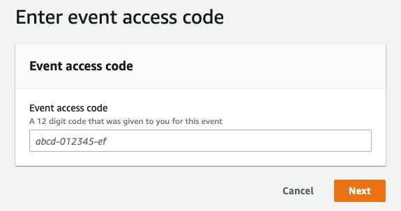

## Follow the steps below to gain access to your Workshop Studio AWS account.

1. [Workshop studio](https://catalog.workshops.aws/join) to access AWS Workshop Studio.

2. Choose your preferred sign-in method as follows. For AWS Guided events, use Email OTP method.  
   

3. Enter your email to receive an one-time password.  
   

4. Enter the one-time password.  
   

5. Enter the code provided by the event organizer, in the text box. You will usually find this code on a slide that is being shown, or a paper printout at your table.  
   

6. Read and agree to the **Terms and Conditions** and click **Join Event**.  
   

7. Click **Get started** 

   

8. Now, you need to follow the workshop instruction. 

## NOTICE!! You already got workshop account,    
## so please SKIP "Follow the steps below to gain access to your Workshop Studio AWS account." in Workshop00.

##  
